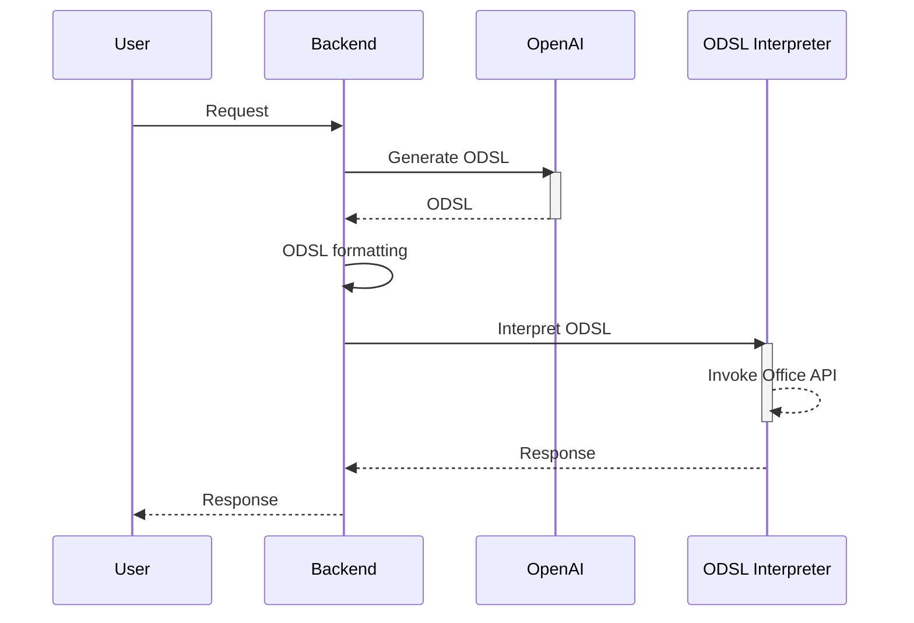

## Mini Office-Copilot

The term ‘Copilot’ is used in the context of a LLM based Question and Answering system, or an Agent-driven automated application. This demo application aims to implement a Domain Specific Language (DSL) approach for triggering commands. A DSL serves as an intermediary script, interpreting user input into actual system commands or API calls.



## Supporting commands

1. Add Outlook schedule
1. Update Outlook schedule 
1. Delete Outlook schedule
1. List up Outlook schedule

## App registrations for Office API

Microsoft > Entra > App registrations > API Permissons

- office_client.py
    - Calendars.ReadWrite : Delegated
    - User.Read : Delegated

- office_client_v2.py
    - Calendars.ReadWrite : Application
    - User.ReadAll : Application

## Launch the server

```bash
streamlit run app.py
```

## Usage

- When you want to remove or update a specific schedule, first, you need to execute a schedule list command.
- Next, send a message with the corresponding schedule number to be modified. The number will be replaced by the schedule ID. Based on this ID, the modification will be carried out. `e.g., I want to delete schedule id 0.`

## Screenshots

- Add Outlook schedule

    <image src="./doc/img01.png" />

- Update Outlook schedule 

    <image src="./doc/img02.png" />