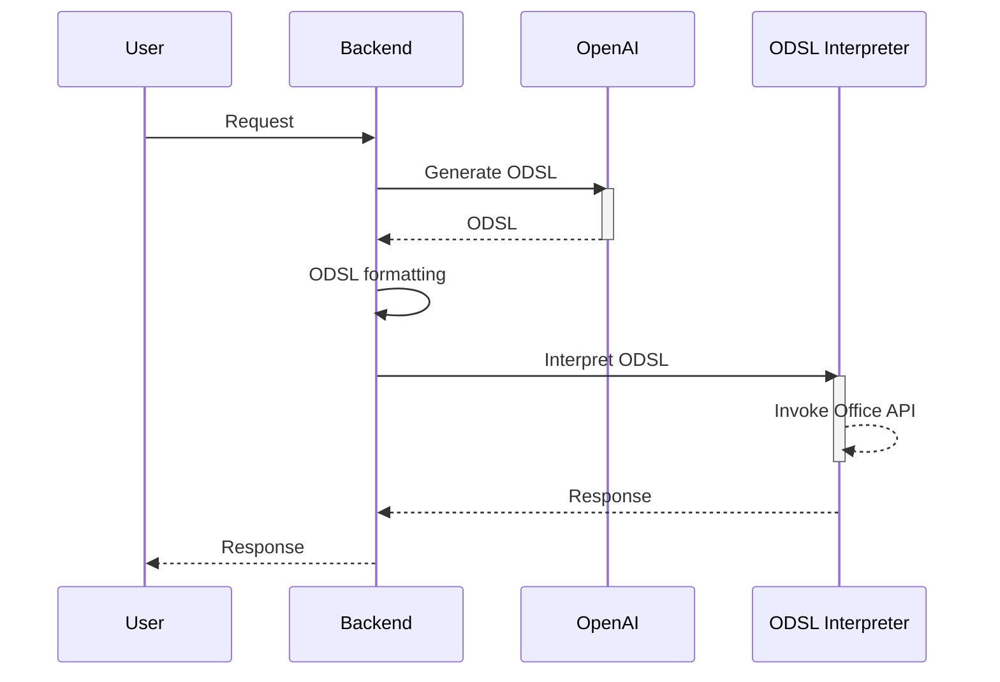

## Mini Office-Copilot

The term ‘Copilot’ is used in the context of a LLM based Question and Answering system, or an Agent-driven automated application. This demo application aims to implement a Domain Specific Language (DSL) approach for triggering commands. A DSL serves as an intermediary script, interpreting user input into actual system commands or API calls.



## Supporting commands

1. Add Outlook schedule
1. Update Outlook schedule 
1. Delete Outlook schedule

## App registrations for Office API

Microsoft > Entra > App registrations > API Permissons

- Calendars.ReadWrite : Delegated
- User.Read : Delegated

## Launch the server

```bash
streamlit run app.py
```

## Screenshots

- Add Outlook schedule

    <image src="./doc/img01.png" />

- Update Outlook schedule 

    <image src="./doc/img02.png" />